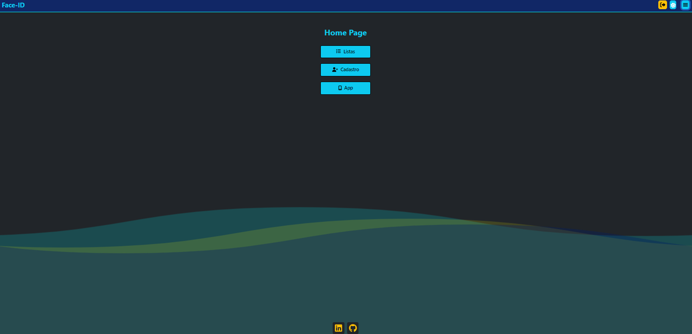
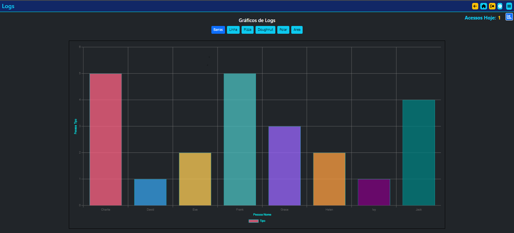
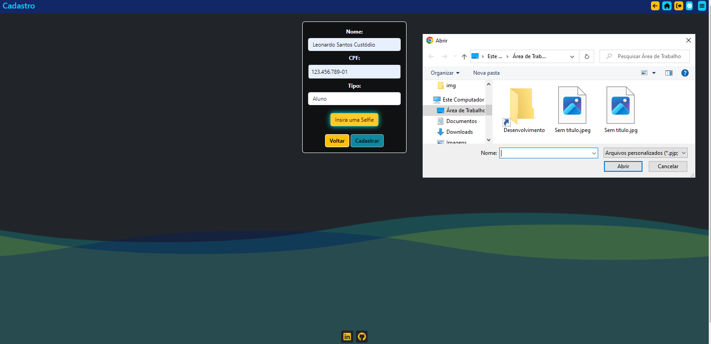
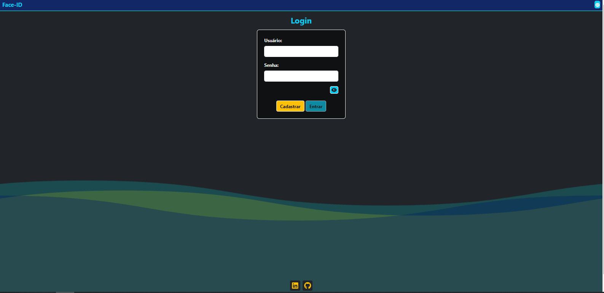
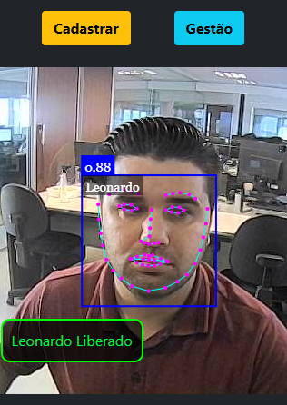

# Projeto de Reconhecimento Facial

Este é um projeto de reconhecimento facial que consiste em três partes principais: o front-end de gerenciamento, o back-end com arquitetura MVC e o reconhecimento facial nativo em JavaScript usando a biblioteca FaceAPI.

## Front-end de Gerenciamento (React)

O front-end de gerenciamento é construído em React e é responsável por gerenciar o processo de reconhecimento facial. Ele inclui as seguintes funcionalidades:

- Realização de operações CRUD de faces cadastradas e usuários do sistema.
- Utilização da biblioteca Chart.js para visualizar dados estatísticos relacionados ao reconhecimento facial.
- Utilização do DataTable React para exibir e gerenciar dados relacionados ao reconhecimento facial.
- Sistema de login com token JWT (básico) e rotas privadas.
- Utilização de temas de acessibilidade com modo escuro armazenado em localStorage.
- Uso de toasts e tooltips.
- Menu Offcanvas.
- Efeitos CSS: Transitions, Animations, Shadows, Hovers.
- Uso do framework Bootstrap.
- Concepção de design responsivo.

## Back-end (Node.js, Express, Sequelize, MySQL)

O back-end é construído em Node.js e utiliza o framework Express para criar a API da aplicação. Além disso, segue o padrão de arquitetura MVC (Model-View-Controller) para uma estrutura organizada e escalável. Ele inclui as seguintes funcionalidades:

- Conexão com um banco de dados MySQL usando Sequelize para armazenar dados relacionados ao reconhecimento facial.
- Gerenciamento de rotas e controladores para manipular solicitações da API.
- Implementação de modelos para representar dados no banco de dados.
- Seeder's para alimentação inicial e uso em testes.
- Pré-configuração dos Migrates das tabelas.
- Alguns testes de rotas já implementados em Jest.

## Reconhecimento (JavaScript, FaceAPI)

Na terceira parte do projeto, você encontrará um diretório dedicado ao reconhecimento facial nativo em JavaScript. A biblioteca FaceAPI é usada para realizar a detecção e reconhecimento facial. Esta parte do projeto pode ser usada para fins de reconhecimento de MÚLTIPLAS FACES simultâneas. Ela reconhece e realiza a liberação de acesso (usando o exemplo de uma escola). Também permite cadastrar novas faces e é acessível a partir de qualquer dispositivo, pois é web responsiva.

## Pré-requisitos

- Node.js e npm instalados.
- Live-Server do VS Code.
- VS Code (Existem tarefas prontas que auxiliam na instalação e atualização das dependências).
- Banco de dados MySQL configurado (os modelos serão gerados pelo ORM - Sequelize).
- Conhecimento em MySql, JS, React, Node.js, Sequelize e Bootstrap.
- Câmera - lembre-se de permitir a permissão da câmera.

## Como Instalar

- OBS: leia o arquivo README.md que está dentro da pasta .vscode.

1. Clone todo o repositório:
   - `git clone ...`

2. Navegue até o diretório do front-end e instale as dependências:
   - `cd .\front-end\`
   - `npm install`

3. Acesse o Back-End e instale as dependências:
   - `cd ..`
   - `cd .\back-end\`
   - `npm install`

4. Instale o arquivo .env e configure-o:
   - Crie um arquivo .env na pasta raiz do back-end.
   - Ajuste e cole o script conforme a configuração do seu MySQL:
     - `DB_HOST=seu-host`
     - `DB_PORT=sua-porta`
     - `DB_USER=seu-usuario`
     - `DB_PASSWORD=seu-password`
     - `DB_DATABASE=reconhecimento` <-- Crie esse schema no seu banco.
     - `JWT_SECRET=defina-sua-secret-key`
     - `process.env.TZ=America/Sao_Paulo` <-- Ajuste seu fuso horário.

5. Acesse o Reconhecimento e instale as dependências:
   - `cd ..`
   - `cd .\reconhecimento\`
   - `npm install`

## Como Executar e Usar

1. Acesse e inicie o back-end:
   - `node app.js`

2. Acesse e inicie o front-end:
   - `npm start`

3. Inicie o reconhecimento:
   - Use o Live-Server para iniciá-lo.

4. Crie um usuário para acessar o sistema de gerenciamento (Front-End em React).

5. Cadastre pelo menos uma face para reconhecimento.

Divirta-se explorando o reconhecimento facial! Se tiver alguma dúvida ou precisar de assistência, sinta-se à vontade para entrar em contato.

## Imagens do Projeto

- Início
  

- Lista de Logs
  

- Gráficos
  

- Cadastro
  

- Login
  

- Reconhecimento
  

### ESTE PROJETO ESTÁ EM CONSTANTE EVOLUÇÃO